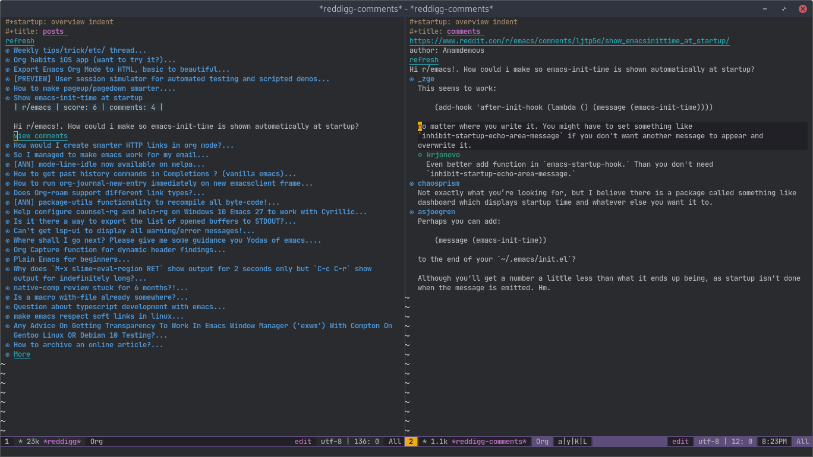
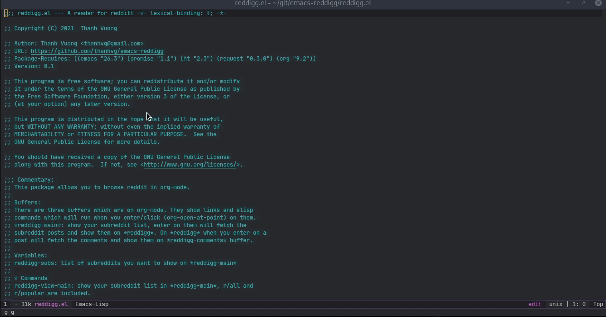

#+STARTUP: content indent
#+title: View Reddit in Emacs org-mode

[[http://spacemacs.org][file:https://cdn.rawgit.com/syl20bnr/spacemacs/442d025779da2f62fc86c2082703697714db6514/assets/spacemacs-badge.svg]]

* Intro

This package lets you browse Reddit in Emacs org-mode.

It also lets you vote, reply, edit, delete, and submit posts.

Reddit requests now require a logged-in browser session for these actions.

~reddigg.el~ uses [[https://github.com/dmgerman/browsel][browsel]] to run Reddit requests inside your browser.

* Requirements

- Emacs 26.3 or later.
- ~promise~ 1.1 or later.
- ~ht~ 2.3 or later.
- ~org~ 9.2 or later.
- [[https://github.com/dmgerman/browsel][browsel]] with its Emacs package and browser extension.
- A logged-in Reddit session in the browser.

* Setup

1. Install the required Emacs packages.
2. Install and configure ~browsel~.
3. Start the ~browsel~ Emacs client.
4. Load the ~browsel~ browser extension.
5. Log in to Reddit in that browser.
6. Open a Reddit tab in that browser.
7. Load ~reddigg.el~ in Emacs.

If no Reddit tab exists, let ~reddigg~ open one when it asks.

* Buffers

~*reddigg-main*~ shows your subreddit list.

~*reddigg*~ shows posts from a subreddit.

~*reddigg-comments*~ shows comments for a post.

The buffers use org-mode.

Enter on a Reddit link to run its Emacs command.

* Variables

~reddigg-subs~ lists the subreddits for ~*reddigg-main*~.

~reddigg-browsel-client~ selects a browser client when more than one client connects.

Set it to ~nil~ for automatic client selection.

~reddigg-reddit-host-regexp~ identifies Reddit tabs by their URL.

~reddigg-reddit-open-url~ sets the URL that ~reddigg~ opens when no Reddit tab exists.

~reddigg-browsel-tab-wait-timeout~ sets the wait time for a new Reddit tab.

* Commands

~reddigg-view-main~ shows your subreddit list.

~reddigg-view-sub~ prompts for a subreddit and shows its posts.

~reddigg-view-frontpage~ shows the front page from ~reddigg-subs~.

~reddigg-view-comments~ prompts for a post and shows its comments.

~reddigg-submit-post~ starts a new post.

~reddigg-refresh-session~ reloads the Reddit login data used for write actions.

* Read posts

1. Run ~reddigg-view-main~.
2. Select a subreddit.
3. Select a post.
4. Enter on ~view comments~ to open its comments.

* Vote

Use these keys in a ~reddigg~ buffer.

- ~C-c C-v u~: upvote.
- ~C-c C-v d~: downvote.
- ~C-c C-v 0~: clear the vote.

The score updates in the current buffer.

* Reply

1. Place point on a post or comment.
2. Press ~C-c C-v r~.
3. Write the reply.
4. Press ~C-c C-c~ to send it.
5. Press ~C-c C-k~ to abort.

The new comment appears under its parent.

* Edit

1. Place point on your post or comment.
2. Press ~C-c C-v e~.
3. Edit the text.
4. Press ~C-c C-c~ to save it.
5. Press ~C-c C-k~ to abort.

~reddigg~ rejects edits for content from another user.

Link posts do not have editable post text.

* Delete

1. Place point on your post or comment.
2. Press ~C-c C-v x~.
3. Confirm the delete prompt.

~reddigg~ rejects deletes for content from another user.

* Submit a post

1. Run ~reddigg-submit-post~.
2. Enter the subreddit name.
3. Select ~self~ or ~link~.
4. Enter the post title.
5. Write the post body or link URL.
6. Press ~C-c C-c~ to submit.
7. Confirm that you want to view the new comments.

For a ~self~ post, enter the post text.

For a ~link~ post, enter the link URL.

~reddigg~ reports the new post ID and URL after a successful submit.

* Compose buffers

~reddigg-compose-mode~ handles reply, edit, and submit buffers.

Press ~C-c C-c~ to send the current compose buffer.

Press ~C-c C-k~ to abort the current compose buffer.

* Reddit session

Write actions use the Reddit session in the browser.

~reddigg~ reads the CSRF token and username from the Reddit page.

~reddigg-refresh-session~ refreshes these values after a login change.

* Remarks

~reddigg~ uses the Reddit API through JavaScript that runs inside the Reddit tab.

Keep the Reddit tab logged in while you use write commands.

For a complete Reddit client, see [[https://github.com/ahungry/md4rd][md4rd]].
